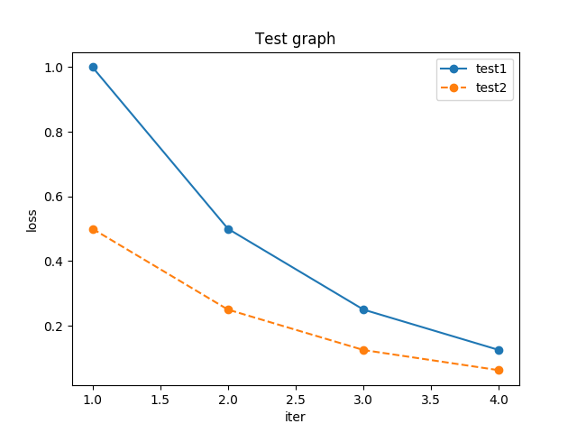

Plotter
=======

数値データの描画ツールです。

使用例

    $ echo "1,1,0.5\n2,0.5,0.25\n3,0.25,0.125\n4,0.125,0.0625" | python plotter.py --separator "," --legend test1 --legend test2 --loc "upper right" --title "Test graph" --xlabel "iter" --ylabel "loss" --savefig test.png

